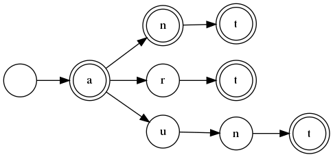

I recently went to a job interview (I'm looking for work, by the way;
hire me!) and one of the questions put to me was "solve the Boggle™
board."  I don't think I did very well on the question and it wasn't
until I got home that I remembered "Dammit, the fastest structure for
checking if a word is in a dictionary is a *trie*!"

Whiteboard exercises are terrible. I don't think I've ever actually
programmed a trie, not even in Data Structures class I took way back in
college in 19mumblemumble.  I'm sure I've used them, but I've never had
to write one. 

## So what is a trie?



A trie is a data structure that encodes *every word* in a dictionary as
a string of nodes, one per letter.  This trie encodes the dictionary
containing the words "a", "an," "ant", "art", and "aunt".  If we're
looking up "ant," we start at the root node and traverse to "a", then
"n", and then "t".  The "t" is double-circled, that is, it's marked as a
terminal node, and thus "ant" is in this dictionary.  If we were looking
up the word "any", we would get to "a,n," and then fail, because "any"
is not in this dictionary.  Likewise, we might ask if "aun" is in the
dictionary, and we would get to "a,u,n," but that "n" is *not*
double-circled, and thus "aun" is also not in this dictionary.

Like a [regular
expression](https://github.com/elfsternberg/riggedregex), a trie search
is successful when the string is exhausted, the trie is still active,
and we find ourselves on a node marked as a word terminator.  If the
trie exhausts before the string, or if the string exhausts on a
non-terminating node, the search fails.

The rules of Boggle™ are very simple: on a 4x4 grid, sixteen die are
shaken and dropped into place.  Each die has six letters on it,
probabistically arranged.  Players have three minutes to find every
valid word on the board, and "valid" means "found in the dictionary the
players have agreed to use," modulo some rules like "no contractions or
abbreviations."

So, we need a trie for our dictionary.  Tries are extremely fast, Ο(n)
where `n` is the length of the word.  They're memory-intensive, but
these days memory is cheaper than time.  Each node has two conditions:
the list of letters that it leads to, and whether or not its a terminal
node.  For the "list of letters," we're going to use a HashMap.  The
child nodes must be boxed as we're building this on the heap (it will be
*huge* for a full-sized dictionary) and it must be RefCell'd because
we'll be mutating child nodes repeatedly as we go along.
```
pub struct Node(HashMap<char, Box<RefCell<Node>>, bool);
```
For this structure, we're going to build it imperatively; that is, each
word will be presented to the structure one at a time, and each word
will be an iterator over its characters.  The first thing we need to do
is say, for a given node, if the word is exhausted, then we are a
terminator node:
```
impl Node {
    pub fn insert(&mut self, word: &mut Iterator<Item = C>) {
        let c = match word.next() {
            None => {
                self.1 = true;
                return;
            }
            Some(c) => c,
        };

```

Note that we're returning from this function if we're a
terminator. There is no character to insert into the next node.

If we're not a terminator, we must then either access or create a child
node, and then keep traversing the word until its exhausted.  In the
"create a new child" scenario, we create the full trie before inserting
it.
```
        match self.0.get(&c) {
            None => {
                let mut newtrie = Node::new();
                newtrie.insert(word);
                self.0.insert(c, Box::new(RefCell::new(newtrie)));
            }
            Some(node) => {
                node.borrow_mut().insert(word);
            }
        };
    }
```

One tricky feature of Boggle™ is that we want to end a search for a word
early if the "word" found isn't really a word.  That is, if on the board
you find the sequence "tk", no word starts with "tk" and you want the
search to terminate early.  But as in our example above, "aun" is also
not a word, but we do not want to terminate the search, as there may be
a handy 't' nearby to finish the word.

So we want to be able to search the trie, but we have two different
criteria: "is this a word" and "*could* this be the prefix of a word?"
We want our search engine to be able to handle both.

How do we handle both?  Let's go back: what are the failure conditions?
The trie gets exhausted *or* the string gets exhausted.  If both are
exhausted at the same time *and* we're on a terminator, it's a word.  If
the word is exhausted but the trie is not, this is a prefix, regardless
of its terminator status.

So, our search feature will be a recursive function that, letter by
letter, transits the trie node by node.  If the word exhausts and we're
still in the trie, we check the end state (always `true` for a prefix,
`is a terminator` for a word), otherwise we recurse down to the next
letter and the next node.

First, let's see what we do if we run out of word.  For the endstate,
we're going to pass it a function that says what to do when we run out
of word:
```
    fn search(&self, word: &mut Iterator<Item = C>, endstate: &Fn(&Node<C>) -> bool) -> bool {
        let c = match word.next() {
            None => return endstate(self),
            Some(c) => c,
        };
```
Note that it's not `pub`!  This is the `search` function, but it's going
to be invoked by the functions that make the distinction.  Flags are a
code smell, and to the extent that you use them, they should never be
accessible to client code.

Finally, if the trie is not exhausted, we try to get the child node,
passing the `endstate` handler forward:
```
        match self.0.get(&c) {
            None => false,
            Some(n) => n.borrow().search(word, endstate),
        }
    }
```

And the two functions, `find` and `prefix`:

```
    pub fn find(&self, word: &mut Iterator<Item = C>) -> bool {
        self.search(word, &|s| s.1)
    }

    pub fn pref(&self, word: &mut Iterator<Item = C>) -> bool {
        self.search(word, &|_s| true)
    }
```

And finally, the constructor.  The idea is that you create a new, empty
node, and then you insert words into the trie, using that node as the
root of the dictionary.  The root node is never a terminator.
```
    pub fn new() -> Node<C> {
        Node(HashMap::new(), false)
    }
}
```
And that's it.  That's the whole of a trie, just two functions: a
builder and a searcher.  I had one special need (whole word vs prefix),
but that was handled by using a distinguishing function as a flag on the
semantics of the search.

Tries are a fun data structure.  This version is pretty memory-heavy; it
might be possible, for those cases where a word prefix has only one
child, to pack them into a denser structure.  The cost of running the
discriminator versus a win on space density might even be worth it.

But if you have a finite dictionary, even one as big as the Scrabble™
legal words list (178,960 words as of 2012), a trie is the fastest data
structure for determining if a string of letters is a real word, or
possibly the prefix of a real word.
